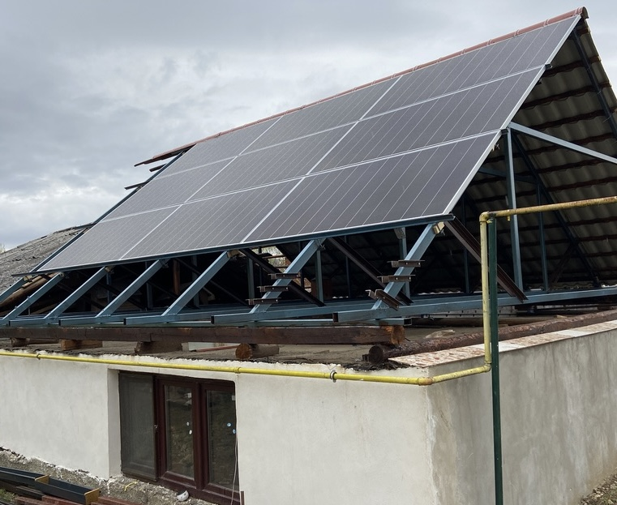

# F-Roof

A single-layer, multi-function roof.

The purpose of the __F-Roof__ is to:

- Protect the house from rain and snow.
- Provide electrical energy to the house.
- Provide food (vegetables) for the house's inhabitants.
- Use structure as function (solar panels and plants' pots are the roof).

## Why F-Roof?

Because:

- Most of the roofs have a single function: to protect the house from rain and snow. We want more from a roof!
- Ground-level soil should be used for growing trees, not vegetables. Vegetables have small roots that require less soil.
- Existing roof-gardens have too many unnecessary layers, thus being expensive. One layer should be enough.
- Soil on the roof provides thermal insulation, so the attic becomes less hot during summer.
- The air behind solar panels could be circulated (with a fan) so the panels' temperature will be reduced and their efficiency will be increased.
- Wood should not be utilized for construction purposes. Trees are more important than for building houses!
- Utilize a minimal amount of materials (solar panels and plant pots have a dual purpose: they provide energy/food and make the roof's structure).

## Maker

[Mihai Oltean](https://mihaioltean.github.io)

## Project location

Street: **Gheorghe Lazăr 9**, town: **Cugir**, country: **Romania**. [Google Maps location](https://maps.app.goo.gl/KsL6PsEaSgzJYHLw7)

## CAD files

[F-Roof CAD](https://github.com/f-roof/cad)

## Materials, tools and software

Brief instructions are given below. More details are in the links.

### Materials

Almost the entire roof is made from metal.
All units are in mm.

- 80x40x3 rectangular tubes.
- 60x40x3 rectangular tubes.
- 50x30x2 rectangular tubes.
- T40 profiles.
- L40 profiles.
- Solar panels. I utilized *Hyundai 485W*.
- Rectangular gutters (filled with soil for plants). I used [Lindab RTRA](https://www.lindab.com/Catalog/building-products/rainwater-systems/gutter/gutter-rectangular/rtra/?sort=popularity&display=16&page=1).
- Roof tiles and some wooden boards (if you do not have enough solar panels or gutters).
- 2 wooden boards of 4500x140x40 (used as steps at the end of the gutters).
- Screws (M8x100, M8x60, etc) (stainless steel), auto-drilling screws.
- M8 auto-lock nuts stainless steel.
- Paint, wood varnish.
- Mastic (around the solar panels).

### Tools

- Band saw (able to cut 80x40mm rectangular tube at 52 degrees angle). I have a [PILOUS ARG 130 mobil](https://www.pilous.cz/en/metal/bandsaws/manual/arg-130-mobil).
- Drill machine. I have a [Milwaukee M18 FDD3](https://www.milwaukeetool.com/).
- Welding machine. I have a [Lorch Handy 160](https://lorch.eu).
- Screwdriver (preferably electric).
- Drill bits.
- Many others...

### Software

- [OpenSCAD](https://openscad.org) - for design.
- [Real Cut 1D](https://optimalprograms.com/realcut1d.htm) - for minimizing the waste when cutting bars.

## Build instructions

- cut, drill, weld, mount.
More details soon...

## Cost

- Prices are for a roof of (approx.) solar side: 6.5m length, roof-garden side: 1.3m and 7 meters depth.

- Prices do not include manufacturing (which I did it by myself) and tools (which I already have).

- Prices are specific to my region (Cugir, Romania). I have not searched for better prices from distant stores. Prices do not include shipping (because I purchased the materials from nearby stores and the shipping was free).

- Prices include VAT.

|Material     |Quantity |Unit |Price per unit| Total price (EURO)|
| ----------- | ------- | --- | ------- | --- |
|80x40x3 tubes|63|m      ||390         |
|60x40x3 tubes|98|m      ||490         |
|50x30x2 tubes|20|m      ||100         |
|T40|42|m||245|
|Solar panels|9|pcs|200|1800|
|Gutters|36|m|25|900|
|Metal tiles|141|$m^2$||284|
|Wood laces (50x30mm)|91|m||50|
|Wood boards (140x40mm)|9|m||25|
|Mastic|9|tubes|8|72|
|Screews, nuts, washers|Many|pcs||300|

Will be updated ...

## Pictures and videos

A video with the exterior and interior of the roof can be found on [YouTube](https://www.youtube.com/watch?v=yZRalp4EQG4).

Pictures are [here](../pictures/).

## License

MIT. You may do whatever you want with this information as long as you mention the author.

## Warning

- I offer *NO warranty* for the information provided in this project!

- I am *NOT an expert* in ANY of the subjects used in the design and construction of this project! 

- Use it on *your OWN risk*!

- This is a work in progress. Everything might change depending on the experiment results.

## Cite as

Mihai Oltean, *F-Roof: A multi-function single-layer roof*, 2023.

## Special thanks to

Nicolae Oltean, Emil Roșu, Dorin Popa, Dani Cotoară, Cristi Simina, Traian Mărginean, Simona Dumitriu, Eduard Șuică, Adi Gorea ... and many others ...