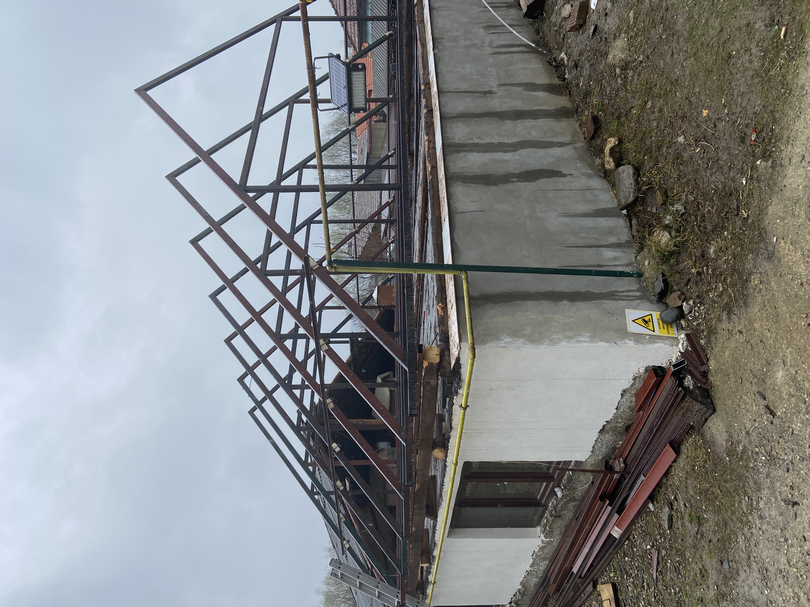
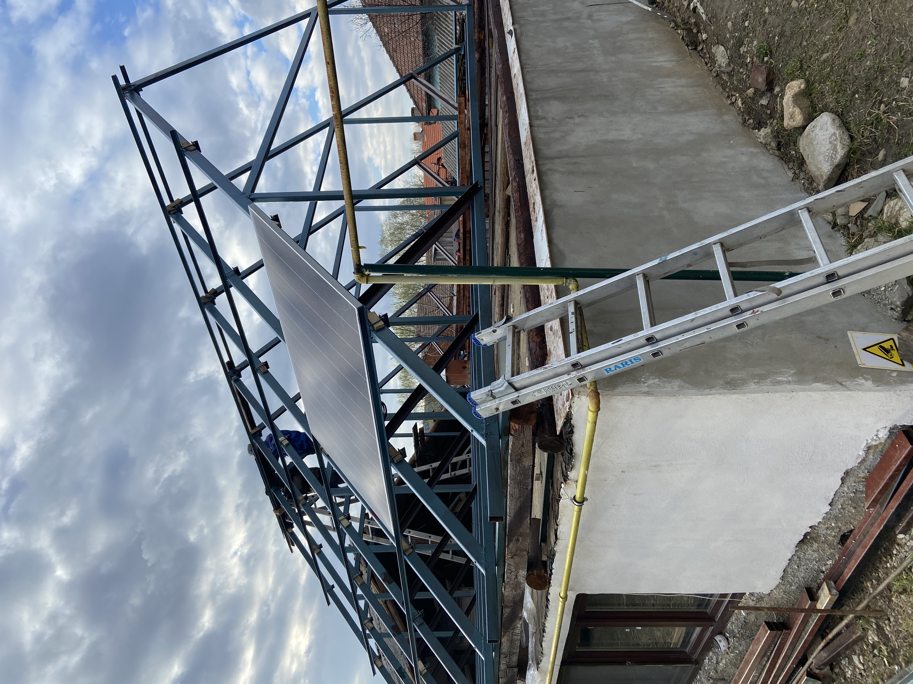
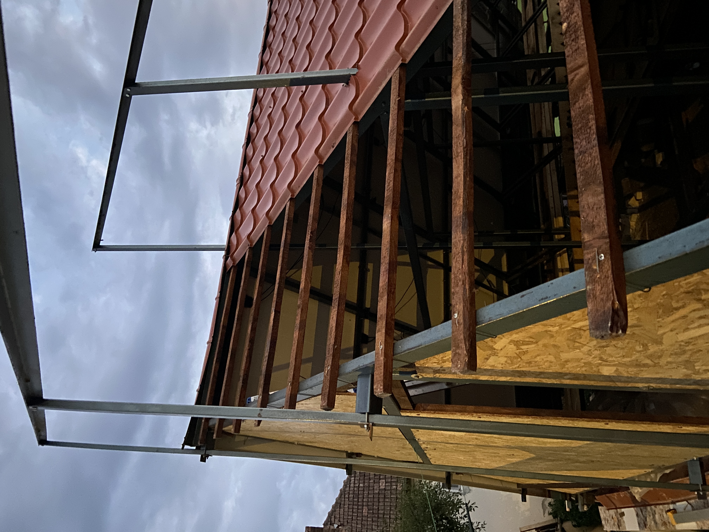
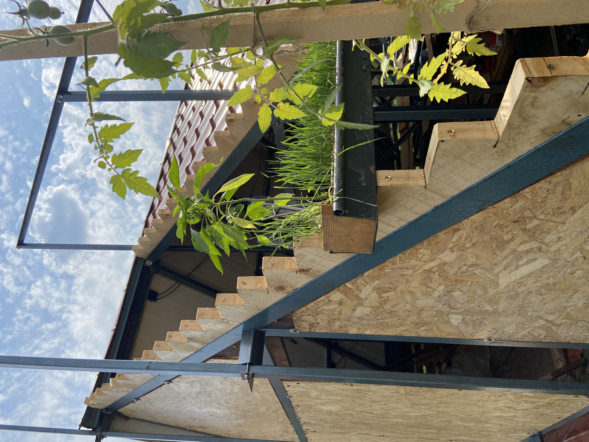
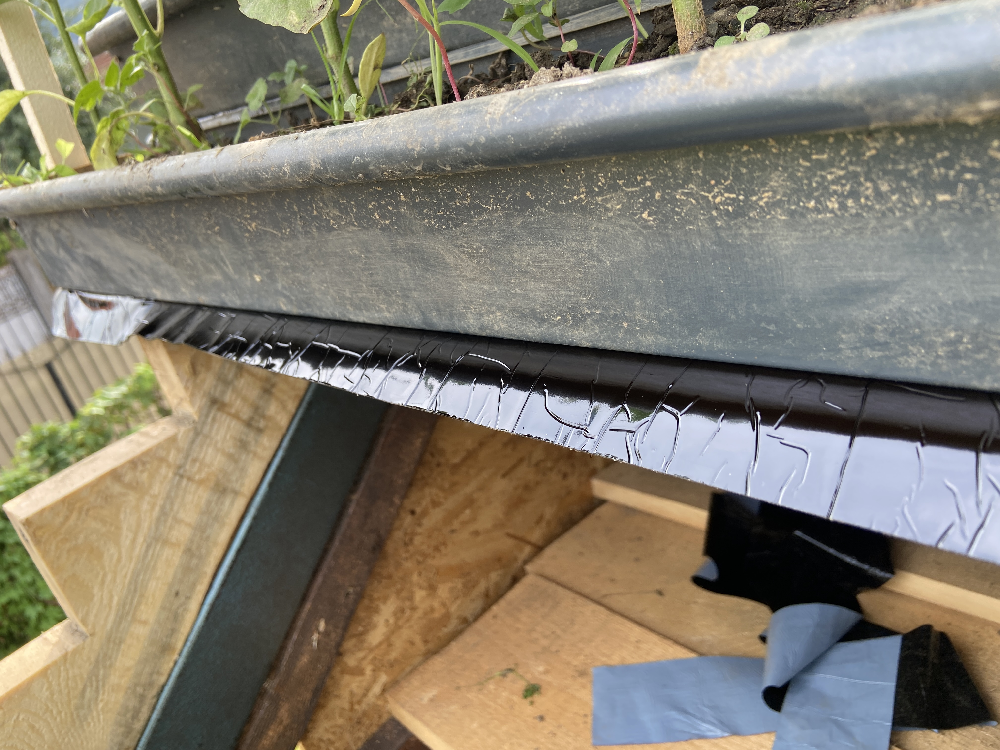

# F-Roof, Build instructions

- Cut the bars to required size and angle:

- Build (weld) the trusses:

- Lift trusses onto the house.

- Connect trusses with T40 profiles:

- Place solar panels on the South side,

- Prepare gutters with plants (at the ground level),

- Prepare (cut) the steps for supporting the gutters,

- Build some balustrade for hand support,

- Lift plant gutters on the roof (North side),

- Apply bituminous tape, behind gutters, to insulate against water leakage,

- Water the plants (every summer day).

[Back to the project homepage](https://github.com/f-roof)